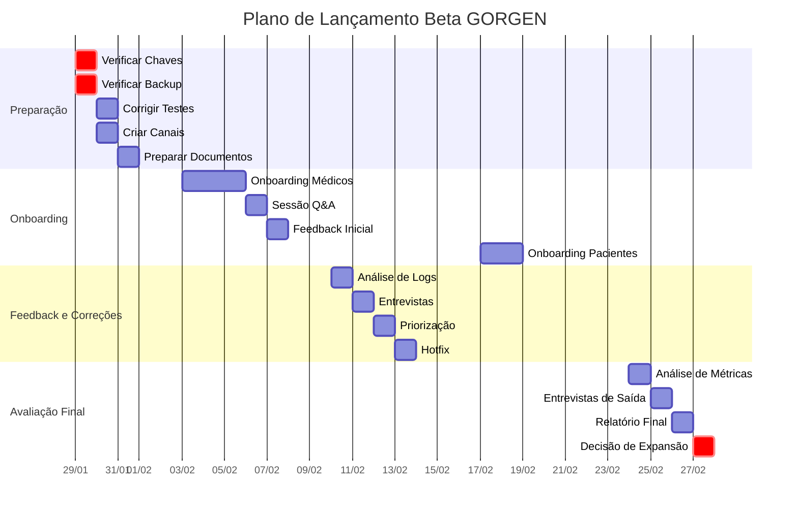

# Plano de Lançamento Beta Restrito - Sistema GORGEN

**Data:** 28 de Janeiro de 2026 | **Objetivo:** 10 Usuários Únicos | **Documento Interno**

---

## 1. Visão Geral

Este documento detalha o plano passo a passo para o lançamento beta restrito do sistema GORGEN, com o objetivo de alcançar 10 usuários únicos e validar a estabilidade, usabilidade e valor da plataforma em um ambiente controlado.

**Duração Total:** 4 semanas
**Início Previsto:** 03 de Fevereiro de 2026
**Término Previsto:** 28 de Fevereiro de 2026

---

## 2. Fases do Lançamento

### Fase 1: Preparação (28/01 - 31/01)

**Objetivo:** Garantir que o ambiente de produção esteja seguro e que os canais de comunicação e suporte estejam prontos.

| Dia | Tarefa | Responsável | Status |
|-----|--------|-------------|--------|
| 28/01 | Criação deste plano de lançamento | Manus AI | ✅ Concluído |
| 29/01 | **Ação Crítica:** Verificar ENCRYPTION_KEY e HMAC_SECRET_KEY em produção | Dr. André | ⏳ Pendente |
| 29/01 | **Ação Crítica:** Verificar execução do backup diário | Dr. André | ⏳ Pendente |
| 30/01 | Corrigir 9 testes falhando (configuração de ambiente) | Desenvolvimento | ⏳ Pendente |
| 30/01 | Criar grupo de WhatsApp para feedback dos usuários beta | Dr. André | ⏳ Pendente |
| 31/01 | Preparar FAQ com perguntas e respostas comuns | Dr. André | ⏳ Pendente |
| 31/01 | Criar documento de Termos de Uso e Política de Privacidade para o beta | Dr. André | ⏳ Pendente |

### Fase 2: Onboarding de Médicos e Secretárias (03/02 - 07/02)

**Objetivo:** Integrar 3 médicos e 3 secretárias à plataforma, garantindo que consigam realizar suas tarefas principais.

| Dia | Tarefa | Usuários |
|-----|--------|----------|
| 03/02 | Onboarding Médico 1 + Secretária 1 | Dr. André |
| 04/02 | Onboarding Médico 2 + Secretária 2 | Dr. André |
| 05/02 | Onboarding Médico 3 + Secretária 3 | Dr. André |
| 06/02 | Sessão de Q&A em grupo com todos os usuários | Dr. André |
| 07/02 | Coleta de feedback inicial (formulário) | Dr. André |

**Checklist de Onboarding (por usuário):**
- [ ] Criação de conta
- [ ] Configuração de perfil
- [ ] Cadastro de 5 pacientes de teste
- [ ] Agendamento de 3 consultas de teste
- [ ] Registro de 1 evolução de teste
- [ ] Explicação do canal de feedback

### Fase 3: Coleta de Feedback e Correções (10/02 - 14/02)

**Objetivo:** Monitorar o uso da plataforma, coletar feedback ativamente e corrigir bugs de alta prioridade.

| Dia | Tarefa | Responsável |
|-----|--------|-------------|
| 10/02 | Análise de logs de uso e erros | Desenvolvimento |
| 11/02 | Entrevistas individuais de 15 min com cada usuário | Dr. André |
| 12/02 | Priorização de bugs e feedback | Dr. André + Dev |
| 13/02 | Implementação de correções (hotfix) | Desenvolvimento |
| 14/02 | Comunicação das melhorias aos usuários | Dr. André |

### Fase 4: Onboarding de Pacientes (17/02 - 21/02)

**Objetivo:** Integrar 4 pacientes à plataforma, garantindo que consigam acessar seus dados e interagir com os médicos.

| Dia | Tarefa | Usuários |
|-----|--------|----------|
| 17/02 | Onboarding Paciente 1 e 2 | Dr. André |
| 18/02 | Onboarding Paciente 3 e 4 | Dr. André |
| 19/02 | Teste de comunicação médico-paciente | Todos |
| 20/02 | Coleta de feedback dos pacientes (formulário) | Dr. André |
| 21/02 | Análise do feedback e planejamento de melhorias | Dr. André + Dev |

**Checklist de Onboarding (por paciente):**
- [ ] Criação de conta
- [ ] Acesso ao prontuário
- [ ] Visualização de exames de teste
- [ ] Envio de mensagem de teste ao médico

### Fase 5: Avaliação Final e Próximos Passos (24/02 - 28/02)

**Objetivo:** Avaliar o sucesso do beta restrito com base nas métricas definidas e decidir sobre a expansão.

| Dia | Tarefa | Responsável |
|-----|--------|-------------|
| 24/02 | Análise final das métricas de sucesso | Dr. André + Dev |
| 25/02 | Entrevistas de saída com todos os usuários | Dr. André |
| 26/02 | Elaboração do relatório de resultados do beta | Dr. André |
| 27/02 | Decisão: expandir para 50 usuários ou manter beta restrito | Dr. André |
| 28/02 | Comunicação dos próximos passos aos usuários | Dr. André |

---

## 3. Métricas de Sucesso

| Métrica | Meta | Mínimo Aceitável | Ferramenta |
|---------|------|------------------|------------|
| Uptime | 99.5% | 99% | UptimeRobot |
| Bugs críticos | 0 | 1 | GitHub Issues |
| NPS (Net Promoter Score) | 8+ | 7 | Formulário Google |
| Taxa de adoção (login semanal) | 80% | 60% | Logs de auditoria |
| Tempo de resposta médio | <500ms | <1000ms | Módulo de Performance |
| Tarefas concluídas com sucesso | 95% | 85% | Entrevistas |

---

## 4. Seleção de Usuários Beta

| Perfil | Quantidade | Critérios de Seleção |
|--------|------------|-----------------------|
| Médicos | 3 | Colegas de confiança, diferentes especialidades, dispostos a dar feedback honesto |
| Secretárias | 3 | Experiência com outros sistemas de gestão, familiaridade com o fluxo do consultório |
| Pacientes | 4 | Perfil tech-savvy, pacientes de longa data, bom relacionamento com a clínica |

---

## 5. Canais de Comunicação e Suporte

**Canal Principal:** Grupo de WhatsApp exclusivo para os usuários beta.
- **Objetivo:** Comunicação rápida, reporte de bugs, Q&A.
- **Regras:** Foco em feedback, respeito mútuo, horário comercial.

**Canal Secundário:** Email dedicado (beta@gorgen.com.br).
- **Objetivo:** Reporte de bugs detalhados, sugestões de melhorias.
- **SLA de Resposta:** 24 horas.

**Suporte Técnico:**
- **Nível 1:** Dr. André (dúvidas de uso, triagem de bugs).
- **Nível 2:** Desenvolvimento (bugs técnicos, problemas de infraestrutura).

---

## 6. Plano de Contingência

| Cenário | Ação Imediata | Comunicação |
|---------|---------------|-------------|
| Bug crítico de segurança | Desativar sistema | Notificar usuários em 1h |
| Perda de dados | Restaurar backup | Notificar usuários em 2h |
| Indisponibilidade > 1h | Investigar causa | Notificar usuários em 30min |
| Feedback negativo massivo | Pausar onboarding | Comunicar plano de ação |

---

## 7. Termos de Uso e Política de Privacidade (Beta)

Um documento simplificado será preparado, com os seguintes pontos:

- O sistema está em fase de testes e pode apresentar instabilidade.
- Os dados inseridos são reais e serão tratados com a mesma segurança da versão final.
- O feedback dos usuários é confidencial e será usado para melhorar o sistema.
- Não há garantia de disponibilidade ou suporte 24/7.
- O uso do sistema durante o beta é gratuito.

---

## 8. Cronograma Visual

