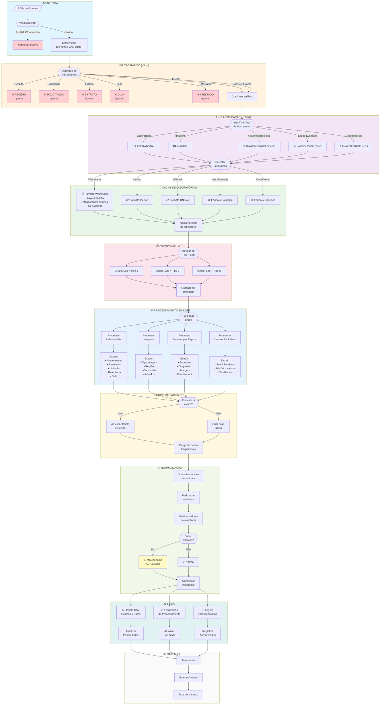
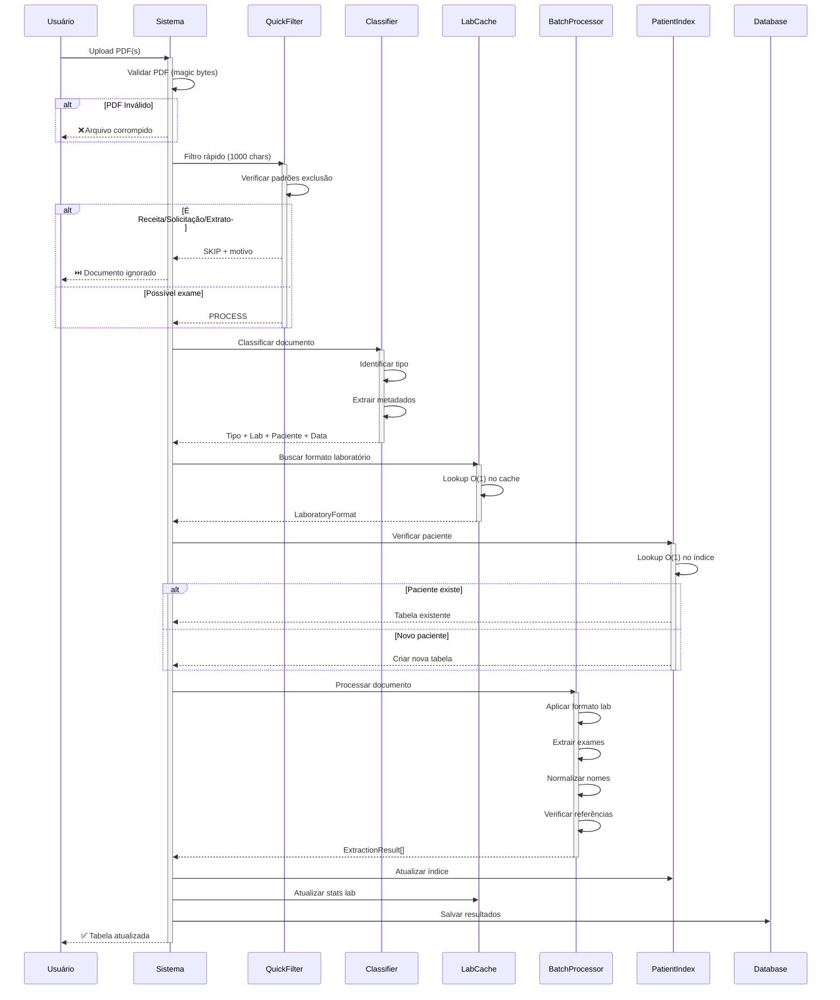
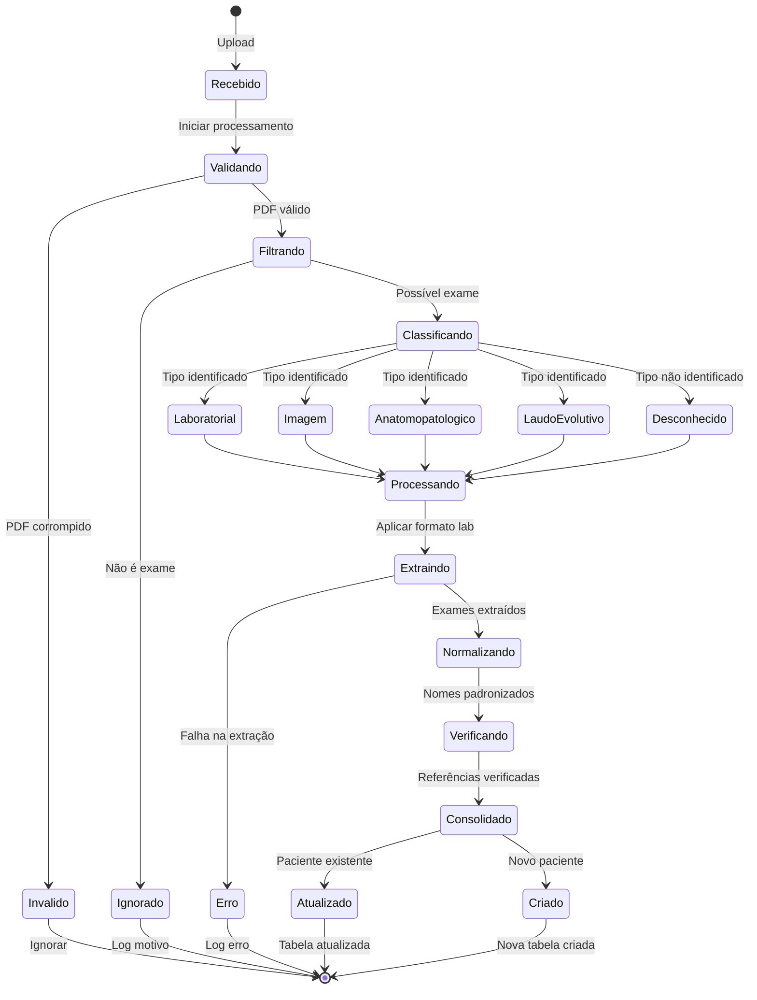
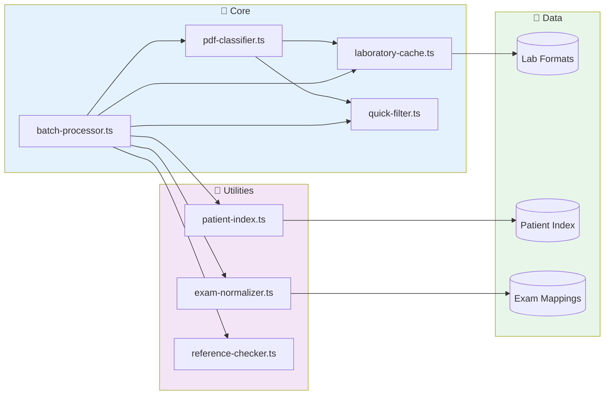

# Fluxo de Processamento de Exames - Gorgen System

## Diagrama de Fluxo Detalhado

## Diagrama de Sequência - Processamento Individual

## Diagrama de Estados - Documento

## Arquitetura de Módulos

## Métricas de Performance por Fase

| Fase | Tempo Médio | Complexidade | Descrição |
|------|-------------|--------------|-----------|
| Validação PDF | 1-2ms | O(1) | Verificar magic bytes |
| Filtro Rápido | 3-5ms | O(n) | Buscar padrões em 1000 chars |
| Classificação | 20-50ms | O(n) | Análise completa do texto |
| Cache Lookup | <1ms | O(1) | Buscar formato do laboratório |
| Patient Index | <1ms | O(1) | Verificar paciente existente |
| Extração | 100-500ms | O(n) | Extrair exames do documento |
| Normalização | 10-20ms | O(m) | Padronizar m exames |
| Consolidação | 5-10ms | O(m) | Merge com dados existentes |

**Total estimado por documento:** 150-600ms (dependendo do tamanho e tipo)

## Prioridades de Processamento

| Prioridade | Tipo | Justificativa |
|------------|------|---------------|
| 1 (Máxima) | Laudo Evolutivo | Dados históricos valiosos |
| 2 | Laboratorial | Alta frequência, muitos exames |
| 2 | Anatomopatológico | Diagnósticos críticos |
| 3 | Imagem | Menor densidade de dados |
| 4 | Desconhecido | Requer análise adicional |
| 5 (Mínima) | Não-exames | Ignorar |
